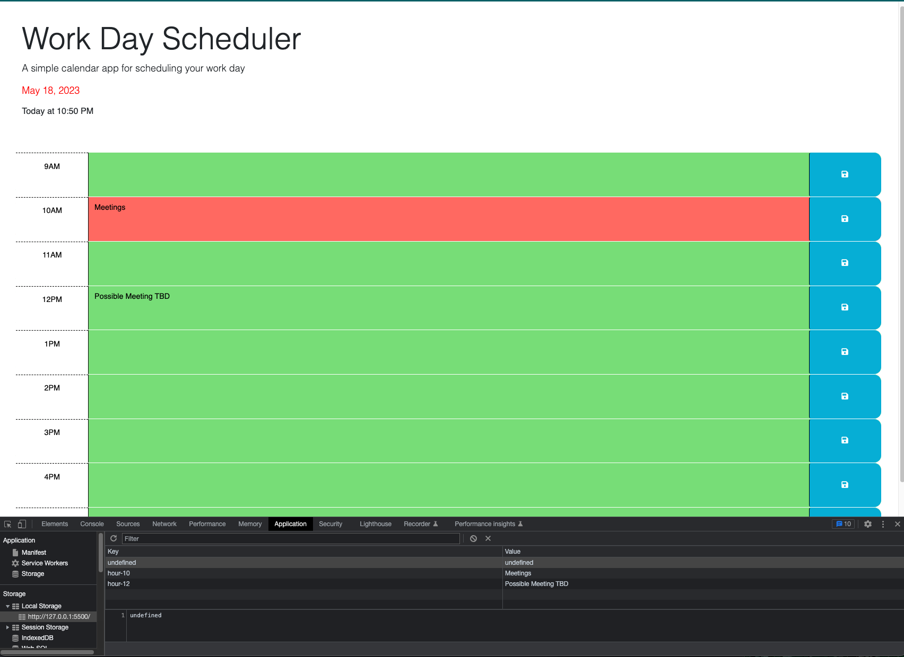

# Module-5

# Daily Planner: Work-Day Schedular

Module 5

## Description

This is a simple daily planner application that allows users to create and manage their daily schedule. It provides a user-friendly interface to organize tasks and events throughout the day. I created the daily planner to ensure that I can manage my time effectively.

## Table of Contents

- [Usage](#usage)
- [Credits](#credits)
- [License](#license)

## Usage

-Open the planner.

-The current day and time will be displayed at the top of the calendar.

-Scroll down to view the time blocks for the day.

-Each time block will be color-coded to represent its status: past, present, or future.

-Click on a time block to enter a task for that hour.

-After entering the task, click the save button to save the text in local storage.

-If the page is refreshed or reopened, the saved tasks will still be displayed.

## Credits

-Amir Hajizadeh- Instructor

-Shawn Littrel- Teacher Aide

-https://day.js.org/docs/en/display/to-now

-https://www.codecademy.com/learn/introduction-to-javascript

-https://developer.mozilla.org/en-US/docs/Web/JavaScript/Guide/Functions

-https://www.w3schools.com/jquery/

## License

MIT License

Copyright (c) 2023 hexd9

Permission is hereby granted, free of charge, to any person obtaining a copy of this software and associated documentation files (the "Software"), to deal in the Software without restriction, including without limitation the rights to use, copy, modify, merge, publish, distribute, sublicense, and/or sell copies of the Software, and to permit persons to whom the Software is furnished to do so, subject to the following conditions:

The above copyright notice and this permission notice shall be included in all copies or substantial portions of the Software.

THE SOFTWARE IS PROVIDED "AS IS", WITHOUT WARRANTY OF ANY KIND, EXPRESS OR IMPLIED, INCLUDING BUT NOT LIMITED TO THE WARRANTIES OF MERCHANTABILITY, FITNESS FOR A PARTICULAR PURPOSE AND NONINFRINGEMENT. IN NO EVENT SHALL THE AUTHORS OR COPYRIGHT HOLDERS BE LIABLE FOR ANY CLAIM, DAMAGES OR OTHER LIABILITY, WHETHER IN AN ACTION OF CONTRACT, TORT OR OTHERWISE, ARISING FROM, OUT OF OR IN CONNECTION WITH THE SOFTWARE OR THE USE OR OTHER DEALINGS IN THE SOFTWARE.

---

🏆 The previous sections are the bare minimum, and your project will ultimately determine the content of this document. You might also want to consider adding the following sections.

## Badges

Badges aren't necessary, per se, but they demonstrate street cred. Badges let other developers know that you know what you're doing. Check out the badges hosted by [shields.io](https://shields.io/). You may not understand what they all represent now, but you will in time.

## Features

-Time Blocks: The planner presents time blocks for standard business hours, allowing users to plan their activities for each hour of the day.

-Local Storage: The application utilizes local storage to save the entered events. When the page is refreshed, the saved events persist, ensuring that users' schedule data is not lost.
